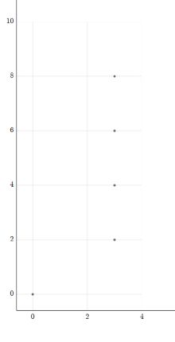

# Topology-Spectral-Sequence

Compute algebraic spectral sequences over exact coefficient domains using explicit quotient-module presentations, Smith normal form, and differential inference, with optional HTML visualization.

## Paper

The accompanying paper is available as [`main.pdf`](main.pdf).

## Features

- Represents each page module as an explicit quotient `Col(S) / Col(Z)` in a fixed ambient free module.
- Uses a custom Smith-normal-form implementation over exact computational PID-style domains to extract module structure and solve linear-algebra subproblems exactly.
- Computes kernels, images, quotient structure, and exact division, and propagates differential information using linearity, quotient relations, and Leibniz-based inference.
- Supports polynomial generators and homogeneous relations in a bigraded algebraic setting.
- Exports computed pages to an interactive HTML spectral-sequence chart through the bundled SeqSee-based frontend.

## Contributors

- **Wenao Liu** — project originator and mathematical lead. As a mathematics PhD, he defined the target functionality, provided mathematical guidance throughout development, and contributed ideas for key algorithms.
- **Yuankun Zou** — lead developer. Co-designed the core algorithms, led the implementation and software architecture, selected the core computational packages, and incorporated Smith normal form into the implementation to formalize and realize the proposed algebraic constructions over exact domains.
- **Yu Xin** — contributed to the optimization and implementation of specific algorithms.

## Installation

Python 3.10 or later is required. From the repository root:

```bash
python -m pip install -e .
```

To install the test dependency as well:

```bash
python -m pip install -e ".[test]"
pytest
```

The core runtime dependencies are SymPy, Jinja2, and jsonschema; they are installed automatically by the package metadata.

## Reproduce the demo

From the repository root, run:

```bash
python src/main.py <min_x> <max_x> <min_y> <max_y> <out.html>
```

Example:

```bash
python src/main.py 0 8 0 8 output.html
```

This builds the sample spectral sequence in `src/main.py`, scans the rectangle of bidegrees you provide, and writes an interactive HTML chart. A successful run ends with output like:

```text
Debug: found 5 total nodes
Generated output.html successfully.
Wrote output.html covering x in [0,8], y in [0,8]
```

The reproduced fourth page has five nontrivial classes in the scanned region: `1` at bidegree `(0, 0)`, and `a*t`, `a*t**2`, `a*t**3`, `a*t**4` at bidegrees `(3, 2)`, `(3, 4)`, `(3, 6)`, `(3, 8)`, respectively. Open `output.html` in a browser to inspect labels and use the interactive chart controls.



## API for custom spectral sequences

The core API is in `src/spectral_sequence.py`.

```python
from sympy import ZZ
from sympy.abc import a, t
from src.spectral_sequence import SpectralSequence

ss = SpectralSequence(
    ZZ,                     # base domain
    [a, t],                 # generators
    [[3, 0], [0, 2]],      # generator bidegrees (2 x n)
    [[1, 0], [-1, 1]],     # differential-bidegree coefficient matrix
)

ss.kill(a**2)              # add relations

# Add pages (E1, E2, E3, ...). known_diff maps src -> d(src) on that page.
p1 = ss.add_page({a: 0, t: 0})
p2 = ss.add_page({a: 0, t: 0})
p3 = ss.add_page({t: a, a: 0})
p4 = ss.add_page()

module = p4[3, 2]
info = module.get_structural_information()
if info is not None:
    gens, torsion = info
```

In this sample, the supplied value `d3(a) = 0` is mathematically redundant because `d3(t) = a` and `d3^2 = 0`; the current implementation does not yet infer `d^2 = 0` automatically.

### Important API notes

- `ss.add_page(known_diff)` expects a dictionary of SymPy expressions in the declared generators.
- `p = ss.add_page(...)` returns a `Page`; index modules with `p[x, y]`.
- `module.get_structural_information()` returns `(generators, torsion)` in absolute coordinates.
- `module.get_diff_span()` and `page.d.get_diff_span(bidegree)` compute differential images. If data is insufficient, the program may request missing differential values interactively.

## Mathematical scope and current limitations

- The current implementation is **first-quadrant**: bidegrees with a negative coordinate are treated as zero.
- Inputs are expected to be homogeneous with respect to the declared bigrading. The basis-enumeration routines also assume the finiteness conditions encoded by the nonnegative-exponent enumeration in `src/utilities.py`.
- Differential product inference currently uses the sign-free Leibniz convention implemented by the project; graded-sign conventions are not yet generalized.
- The program validates and propagates known differential data, but it does **not** yet automatically infer consequences of `d^2 = 0`.
- Some differential values may still need to be supplied interactively when the available algebraic information does not determine them uniquely.

### Base-domain assumptions

This repository uses a **custom Smith-normal-form implementation** in `src/snf.py`, built on SymPy's exact `DomainMatrix`/domain arithmetic. It does not simply delegate the spectral-sequence computations to SymPy's high-level Smith-normal-form routine.

- The SNF implementation uses exact domain operations such as `gcdex`, `rem`, and `exquo`.
- `SNFMatrix` verifies `domain.is_PID`.
- In practice, the implementation is aimed at Euclidean-style computational PID domains such as `ZZ`, finite fields like `GF(p)`, and other exact fields/domains that provide the required operations.
- A non-Euclidean PID is not currently a supported computational target; decomposition can fail or hit the explicit non-convergence guard.

If you provide a custom domain, ensure those exact-division, gcd, and remainder operations are implemented consistently.

## Third-party components

The HTML spectral-sequence visualization is adapted from [SeqSee](https://github.com/JoeyBF/SeqSee), developed by Joey Beauvais-Feisthauer and distributed under the MIT License.

The adapted/copied components in this repository include:

- `seqsee_main.py`
- `template.html.jinja`
- `input_schema.json`

The original SeqSee copyright notice and MIT License are preserved in `seqsee_main.py` and separately in [`THIRD_PARTY_LICENSES/SeqSee.txt`](THIRD_PARTY_LICENSES/SeqSee.txt). The root [`LICENSE`](LICENSE) applies to this repository's own code unless otherwise noted.
